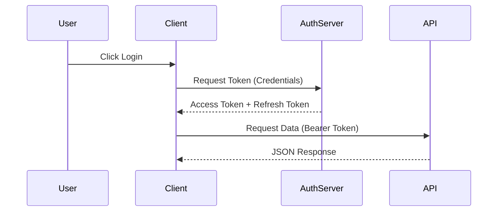
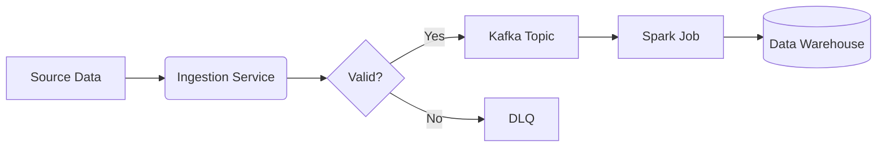

# Diagramming & Documentation

Communicating architecture effectively is as important as building it.

## The C4 Model

A hierarchical approach to visualizing software architecture.

1.  **Context**: System + Users + External Systems.
2.  **Containers**: Applications, Databases, Microservices (deployable units).
3.  **Components**: Modules/Classes inside a container.
4.  **Code**: UML class diagrams (rarely needed).

## Mermaid.js Examples

Diagrams-as-Code allows you to version control your architecture.

### Sequence Diagram (Authentication Flow)

### Flowchart (Data Pipeline)

## Architecture Decision Records (ADRs)

Documenting *why* a decision was made.

**Template:**
- **Title**: Short summary.
- **Status**: Proposed, Accepted, Deprecated.
- **Context**: The problem and constraints.
- **Decision**: What we are doing.
- **Consequences**: Pros, Cons, and risks.
